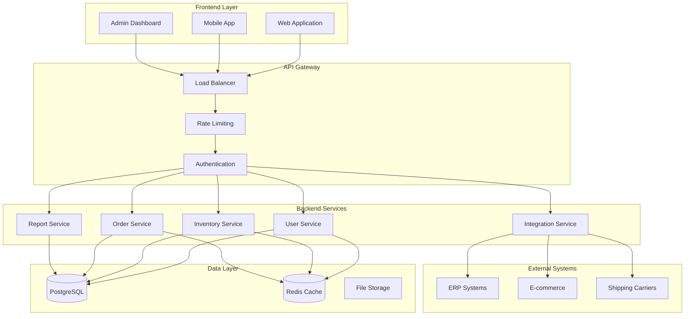
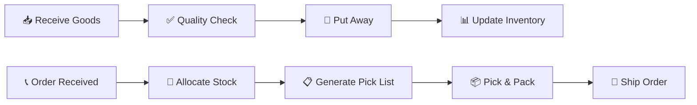

# 🏭 Warehouse Management System (WMS)

<div align="center">


**A comprehensive, modern warehouse management solution for businesses of all sizes**

[](https://opensource.org/licenses/MIT)
[](https://www.docker.com/)
[](https://www.postgresql.org/)
[](https://nodejs.org/)
[](https://reactjs.org/)

[🚀 Quick Start](#-quick-start) • [📚 Documentation](#-documentation) • [🎯 Features](#-features) • [💻 Demo](#-demo)

</div>

---

## 📋 Table of Contents

- [🎯 Features](#-features)
- [🏗️ Architecture](#️-architecture)
- [🚀 Quick Start](#-quick-start)
- [📦 Installation](#-installation)
- [🔧 Configuration](#-configuration)
- [📱 Usage](#-usage)
- [🔌 API Documentation](#-api-documentation)
- [📊 Database Schema](#-database-schema)
- [🎨 UI/UX Design](#-uiux-design)
- [🔄 Workflows](#-workflows)
- [🛠️ Tech Stack Options](#️-tech-stack-options)
- [🧪 Testing](#-testing)
- [🚀 Deployment](#-deployment)
- [🤝 Contributing](#-contributing)
- [📄 License](#-license)

---

## 🎯 Features

### 📦 **Inventory Management**
- ✅ Real-time stock tracking across multiple warehouses
- ✅ Automated low stock alerts and reorder notifications
- ✅ Barcode/QR code scanning for accuracy
- ✅ ABC analysis and inventory valuation
- ✅ Batch/lot tracking with expiry date management
- ✅ Cycle counting and stock adjustments

### 📥 **Inbound Operations**
- ✅ Purchase order management with supplier integration
- ✅ Goods receipt notes (GRN) with quality inspection
- ✅ Put-away optimization with location suggestions
- ✅ Receipt discrepancy tracking and resolution
- ✅ Vendor performance monitoring

### 📤 **Outbound Operations**
- ✅ Sales order processing with allocation engine
- ✅ Pick list generation with optimal routing
- ✅ Wave planning and batch picking
- ✅ Packing and shipping with carrier integration
- ✅ Delivery order (DO) management
- ✅ Customer portal for order tracking

### 🏢 **Warehouse Operations**
- ✅ Multi-warehouse and multi-location support
- ✅ Dynamic location management (Zone → Aisle → Shelf → Bin)
- ✅ Flexible storage strategies (FIFO, LIFO, FEFO)
- ✅ Cross-docking and transfer orders
- ✅ Labor management and productivity tracking

### 👥 **User Management & Security**
- ✅ Role-based access control (Admin, Manager, Staff, Viewer)
- ✅ JWT authentication with refresh tokens
- ✅ Audit trails for all transactions
- ✅ User activity monitoring
- ✅ Permission matrix by function

### 📊 **Reports & Analytics**
- ✅ Real-time dashboard with KPIs
- ✅ Inventory reports (valuation, aging, turnover)
- ✅ Operational reports (productivity, accuracy)
- ✅ Financial reports with cost analysis
- ✅ Custom report builder
- ✅ Export to PDF, Excel, CSV

### 📱 **Mobile Support**
- ✅ Responsive web design for all devices
- ✅ Mobile-optimized scanning interfaces
- ✅ Offline capability for critical operations
- ✅ Progressive Web App (PWA) support

### 🔗 **Integrations**
- ✅ RESTful APIs for ERP/E-commerce integration
- ✅ Webhook support for real-time data sync
- ✅ EDI integration for suppliers/customers
- ✅ Third-party shipping carrier APIs

---

## 🏗️ Architecture

### **System Architecture**



### **Technology Stack**

| Component | Technology | Purpose |
|-----------|------------|---------|
| **Frontend** | React/Vue/Angular | User interface and experience |
| **Backend** | Node.js/Go/Java/.NET | Business logic and APIs |
| **Database** | PostgreSQL/MySQL | Primary data storage |
| **Cache** | Redis | Session storage and caching |
| **Container** | Docker & Docker Compose | Development and deployment |
| **Proxy** | Nginx | Load balancing and reverse proxy |
| **Auth** | JWT | Authentication and authorization |

---

## 🚀 Quick Start

### **Prerequisites**

- 🐳 [Docker](https://www.docker.com/get-started) (20.10+)
- 🐳 [Docker Compose](https://docs.docker.com/compose/install/) (2.0+)
- 💻 [Git](https://git-scm.com/downloads)

### **1-Minute Setup**

```bash
# Clone the repository
git clone https://github.com/your-username/warehouse-management-system.git
cd warehouse-management-system

# Run setup script (Linux/macOS)
chmod +x setup-dev.sh
./setup-dev.sh

# OR for Windows
setup-dev.bat
```

That's it! 🎉 Your development environment is ready.

### **Access the Application**

| Service | URL | Credentials |
|---------|-----|-------------|
| 🌐 **Frontend** | http://localhost:3001 | - |
| 🔧 **Backend API** | http://localhost:3000 | - |
| 🗄️ **pgAdmin** | http://localhost:5050 | admin@warehouse.local / admin123 |
| 🔴 **Redis Commander** | http://localhost:8081 | - |
| 📧 **MailHog** | http://localhost:8025 | - |

### **Default Login**
- **Username**: `admin`
- **Password**: `admin123`

---

## 📦 Installation

### **Manual Installation (without Docker)**

<details>
<summary>Click to expand manual installation steps</summary>

#### **Backend Setup**

```bash
# Navigate to backend directory
cd backend

# Install dependencies
npm install

# Copy environment file
cp .env.example .env

# Edit database configuration
nano .env

# Run database migrations
npm run migrate

# Seed sample data
npm run seed

# Start development server
npm run dev
```

#### **Frontend Setup**

```bash
# Navigate to frontend directory
cd frontend

# Install dependencies
npm install

# Copy environment file
cp .env.example .env

# Start development server
npm start
```

#### **Database Setup**

```bash
# Install PostgreSQL
sudo apt-get install postgresql postgresql-contrib

# Create database and user
sudo -u postgres psql
CREATE DATABASE warehouse_db;
CREATE USER warehouse_user WITH PASSWORD 'warehouse_pass123';
GRANT ALL PRIVILEGES ON DATABASE warehouse_db TO warehouse_user;
\\q

# Run schema
psql -U warehouse_user -d warehouse_db -f database/schema.sql
```

</details>

---

## 🔧 Configuration

### **Environment Variables**

The system uses environment variables for configuration. Copy `.env.example` to `.env` and modify:

<details>
<summary>Key Configuration Options</summary>

```bash
# Application
APP_NAME=Warehouse Management System
APP_ENV=development
APP_URL=http://localhost
APP_PORT=3000

# Database
DB_HOST=postgres
DB_PORT=5432
DB_DATABASE=warehouse_db
DB_USERNAME=warehouse_user
DB_PASSWORD=warehouse_pass123

# Redis
REDIS_HOST=redis
REDIS_PORT=6379

# JWT Authentication
JWT_SECRET=your-secret-key-here
JWT_EXPIRES_IN=24h

# File Upload
MAX_FILE_SIZE=10485760
UPLOAD_PATH=/app/uploads

# Email (SMTP)
MAIL_HOST=mailhog
MAIL_PORT=1025
MAIL_FROM_ADDRESS=noreply@warehouse.local

# Integration APIs
ERP_API_URL=https://your-erp-system.com/api
ERP_API_KEY=your-api-key
```

</details>

### **Docker Configuration**

The `docker-compose.yml` includes:

- **PostgreSQL 15** with persistent data
- **Redis 7** for caching and sessions
- **Nginx** as reverse proxy
- **pgAdmin 4** for database management
- **MailHog** for email testing
- **Volume mounting** for development

---

## 📱 Usage

### **Getting Started Guide**

1. **🔐 Login**: Access the system with admin credentials
2. **🏢 Setup Warehouse**: Configure your warehouse locations
3. **📦 Add Products**: Import or manually add your product catalog
4. **👥 Create Users**: Add staff members with appropriate roles
5. **📊 Monitor Dashboard**: Track key metrics and activities

### **Daily Operations Workflow**



### **User Roles & Permissions**

| Role | Inventory | Orders | Reports | Users | Settings |
|------|-----------|--------|---------|-------|----------|
| **Admin** | ✅ Full | ✅ Full | ✅ Full | ✅ Full | ✅ Full |
| **Manager** | ✅ Full | ✅ Full | ✅ Full | ❌ | ✅ Limited |
| **Staff** | 👁️ View | ✅ Process | 👁️ View | ❌ | ❌ |
| **Viewer** | 👁️ View | 👁️ View | 👁️ View | ❌ | ❌ |

---

## 🔌 API Documentation

### **Base URL**
```
http://localhost:3000/api/v1
```

### **Authentication**
```bash
# Login
POST /auth/login
{
  "username": "admin",
  "password": "admin123"
}

# Response
{
  "success": true,
  "data": {
    "user": {...},
    "token": "eyJhbGciOiJIUzI1NiIsInR5cCI6IkpXVCJ9...",
    "refresh_token": "..."
  }
}
```

### **Core Endpoints**

<details>
<summary>📦 Products API</summary>

```bash
# Get all products
GET /products?page=1&limit=20&search=widget

# Get product by ID
GET /products/{id}

# Create product
POST /products
{
  "sku": "SKU-001",
  "name": "Widget A",
  "category_id": "uuid",
  "supplier_id": "uuid",
  "cost_price": 10.00,
  "selling_price": 15.00
}

# Update product
PUT /products/{id}

# Delete product (soft delete)
DELETE /products/{id}
```

</details>

<details>
<summary>📊 Inventory API</summary>

```bash
# Get inventory levels
GET /inventory?warehouse_id=uuid&status=low_stock

# Get inventory by product
GET /inventory/product/{product_id}

# Stock adjustment
POST /inventory/adjustments
{
  "warehouse_id": "uuid",
  "reason": "count_variance",
  "items": [
    {
      "product_id": "uuid",
      "location_id": "uuid",
      "current_quantity": 100,
      "adjusted_quantity": 95,
      "notes": "Damaged items found"
    }
  ]
}
```

</details>

<details>
<summary>🛒 Orders API</summary>

```bash
# Create purchase order
POST /purchase-orders
{
  "supplier_id": "uuid",
  "expected_date": "2024-01-20",
  "items": [
    {
      "product_id": "uuid",
      "quantity": 100,
      "unit_price": 10.00
    }
  ]
}

# Create sales order
POST /sales-orders
{
  "customer_id": "uuid",
  "requested_date": "2024-01-18",
  "priority": "high",
  "items": [
    {
      "product_id": "uuid",
      "quantity": 10,
      "unit_price": 15.00
    }
  ]
}
```

</details>

### **Response Format**

```json
{
  "success": true,
  "data": { ... },
  "message": "Operation completed successfully",
  "pagination": {
    "page": 1,
    "limit": 20,
    "total": 150,
    "total_pages": 8
  },
  "timestamp": "2024-01-15T10:30:00Z"
}
```

---

## 📊 Database Schema

### **Core Tables**

```sql
-- Products and inventory
products (id, sku, name, category_id, supplier_id, ...)
inventory (id, product_id, warehouse_id, location_id, quantity, ...)
categories (id, name, parent_id, ...)
suppliers (id, name, contact_info, ...)

-- Warehouse management
warehouses (id, name, code, address, ...)
locations (id, warehouse_id, zone, aisle, shelf, bin, ...)

-- Inbound operations
purchase_orders (id, po_number, supplier_id, status, ...)
purchase_order_items (id, purchase_order_id, product_id, quantity, ...)
inbound_receipts (id, grn_number, purchase_order_id, ...)
inbound_receipt_items (id, inbound_receipt_id, product_id, ...)

-- Outbound operations
sales_orders (id, order_number, customer_id, status, ...)
sales_order_items (id, sales_order_id, product_id, quantity, ...)
outbound_shipments (id, do_number, sales_order_id, ...)
outbound_shipment_items (id, outbound_shipment_id, product_id, ...)

-- System tables
users (id, username, email, role, ...)
audit_logs (id, user_id, table_name, action, ...)
inventory_movements (id, product_id, movement_type, quantity, ...)
```

### **Entity Relationships**

- **Products** → **Categories** (Many-to-One)
- **Products** → **Suppliers** (Many-to-One)
- **Inventory** → **Products**, **Warehouses**, **Locations** (Many-to-One)
- **Purchase Orders** → **Purchase Order Items** (One-to-Many)
- **Sales Orders** → **Sales Order Items** (One-to-Many)
- **Users** → **Audit Logs** (One-to-Many)

---

## 🎨 UI/UX Design

### **Design System**

- **Color Palette**: Blue primary (#2563EB), Green success (#059669)
- **Typography**: Inter/Roboto for UI, JetBrains Mono for codes
- **Components**: Modern, accessible, responsive design
- **Icons**: Consistent iconography throughout the system

### **Key Screens**

<details>
<summary>📊 Dashboard</summary>

- Real-time KPI cards (Products, Stock Value, Low Stock, Pending Orders)
- Recent activities timeline
- Stock movement trends chart
- Top products by movement
- Quick action buttons

</details>

<details>
<summary>📦 Inventory Management</summary>

- Advanced filtering and search
- Stock status indicators (OK, Low, Out of Stock)
- Bulk operations (export, adjust, transfer)
- Location tracking with visual indicators
- Mobile-optimized for warehouse floor use

</details>

<details>
<summary>📥 Goods Receipt</summary>

- Step-by-step workflow (Receive → QC → Put Away → Complete)
- Barcode scanning integration
- Discrepancy handling
- Location suggestions
- Photo capture for quality issues

</details>

### **Mobile Interface**

- Touch-optimized controls (44px minimum)
- Barcode scanner integration
- Offline capability for critical functions
- Progressive Web App (PWA) support
- Native app-like experience

---

## 🔄 Workflows

### **Inbound Process**

1. **📋 Create Purchase Order** → Supplier selection, item specification
2. **📦 Goods Arrival** → Dock scheduling, document verification
3. **📝 Create GRN** → Item scanning, quantity verification
4. **✅ Quality Check** → Inspection, acceptance/rejection
5. **📍 Put Away** → Location assignment, stock update
6. **📊 Inventory Update** → Real-time stock adjustment

### **Outbound Process**

1. **📞 Sales Order** → Customer order entry, stock allocation
2. **🎯 Order Allocation** → Inventory reservation, priority handling
3. **📋 Pick List Generation** → Route optimization, batch creation
4. **📦 Picking** → Location guidance, quantity verification
5. **📦 Packing** → Quality check, shipping documentation
6. **🚚 Shipping** → Carrier selection, tracking generation

### **Exception Handling**

- **Stock Shortages**: Backorder creation, supplier notifications
- **Damaged Goods**: Quarantine process, supplier returns
- **System Downtime**: Manual fallback procedures
- **Quality Issues**: Hold/reject workflows, supplier quality scores

---

## 🛠️ Tech Stack Options

We provide multiple technology stack options to suit different preferences and requirements:

### **Frontend Options**

<details>
<summary>⚛️ React Stack (Recommended)</summary>

**Pros:**
- 🚀 Large ecosystem and community
- 📱 React Native for mobile apps
- 🔄 Excellent state management with Redux/Zustand
- 📚 Extensive documentation and tutorials

**Cons:**
- 📈 Steeper learning curve for beginners
- 🔧 Requires additional setup for full functionality

**Tech Stack:**
- React 18+ with TypeScript
- Vite for build tooling
- TailwindCSS for styling
- React Query for data fetching
- React Hook Form for forms

</details>

<details>
<summary>🖖 Vue.js Stack</summary>

**Pros:**
- 📖 Gentle learning curve
- 🎯 Excellent developer experience
- 📦 Built-in state management (Pinia)
- 🔧 Less configuration required

**Cons:**
- 👥 Smaller ecosystem compared to React
- 📱 Limited mobile app options

**Tech Stack:**
- Vue 3 with Composition API
- Nuxt.js for full-stack features
- Vuetify/PrimeVue for UI components
- Pinia for state management

</details>

<details>
<summary>🅰️ Angular Stack</summary>

**Pros:**
- 🏢 Enterprise-ready with TypeScript
- 🔧 Comprehensive framework (routing, forms, HTTP)
- 📱 Ionic for mobile development
- 🎯 Strong opinions and structure

**Cons:**
- 📈 Steep learning curve
- 🐘 Can be heavyweight for small projects

**Tech Stack:**
- Angular 15+ with TypeScript
- Angular Material for UI
- NgRx for state management
- Ionic for mobile apps

</details>

### **Backend Options**

<details>
<summary>🟢 Node.js Stack (Recommended)</summary>

**Pros:**
- 🚀 JavaScript everywhere (frontend/backend)
- 📦 NPM ecosystem with millions of packages
- ⚡ High performance for I/O operations
- 👥 Large developer community

**Cons:**
- 🔄 Single-threaded (can be limiting for CPU-intensive tasks)
- 🐛 Callback hell (mitigated with async/await)

**Tech Stack:**
- Node.js 18+ with TypeScript
- Express.js or Fastify for REST API
- Prisma or TypeORM for database
- Jest for testing

</details>

<details>
<summary>🐹 Go Stack</summary>

**Pros:**
- ⚡ Excellent performance and concurrency
- 📦 Single binary deployment
- 🔒 Strong typing and memory safety
- 🏗️ Great for microservices

**Cons:**
- 📚 Smaller ecosystem compared to Node.js
- 📈 Learning curve for JavaScript developers

**Tech Stack:**
- Go 1.19+ with Gin/Echo framework
- GORM for database ORM
- Docker for containerization
- Testify for testing

</details>

<details>
<summary>☕ Java Spring Boot Stack</summary>

**Pros:**
- 🏢 Enterprise-grade with excellent tooling
- 🔒 Strong type safety and performance
- 📚 Mature ecosystem and libraries
- 🔧 Comprehensive framework features

**Cons:**
- 🐘 Can be verbose and heavyweight
- 📈 Steep learning curve for beginners

**Tech Stack:**
- Java 17+ with Spring Boot 3
- Spring Data JPA for database
- Spring Security for authentication
- JUnit 5 for testing

</details>

<details>
<summary>🔷 .NET Stack</summary>

**Pros:**
- 🏢 Enterprise-ready with Microsoft ecosystem
- ⚡ Excellent performance
- 🔧 Rich tooling and IDE support
- 🔄 Cross-platform with .NET Core

**Cons:**
- 💰 Can be expensive for enterprise licenses
- 🏢 Primarily Windows-focused ecosystem

**Tech Stack:**
- .NET 7+ with ASP.NET Core
- Entity Framework Core for database
- Identity Server for authentication
- xUnit for testing

</details>

### **Database Options**

<details>
<summary>🐘 PostgreSQL (Recommended)</summary>

**Pros:**
- 🔒 ACID compliance and reliability
- 📊 Advanced features (JSON, arrays, full-text search)
- 📈 Excellent performance and scalability
- 🆓 Open source with strong community

**Cons:**
- 🔧 Requires more setup than SQLite
- 📚 Learning curve for advanced features

</details>

<details>
<summary>🐬 MySQL</summary>

**Pros:**
- 👥 Widely adopted and supported
- ⚡ Fast read performance
- 🔧 Easy to set up and manage
- 🌐 Excellent web hosting support

**Cons:**
- 🔒 Less strict with data integrity
- 📊 Limited advanced features compared to PostgreSQL

</details>

<details>
<summary>🍃 MongoDB</summary>

**Pros:**
- 📄 Flexible document-based storage
- 📈 Horizontal scaling capabilities
- 🚀 Rapid development for changing requirements
- 📊 Built-in aggregation framework

**Cons:**
- 🔒 No ACID transactions across documents
- 📈 Can lead to data inconsistency if not carefully designed

</details>

### **Deployment Options**

<details>
<summary>🐳 Docker + Cloud (Recommended)</summary>

**Services:**
- AWS ECS/EKS
- Google Cloud Run/GKE
- Azure Container Instances/AKS
- DigitalOcean App Platform

</details>

<details>
<summary>☁️ Serverless</summary>

**Services:**
- AWS Lambda + API Gateway
- Vercel Functions
- Netlify Functions
- Azure Functions

</details>

<details>
<summary>🖥️ Traditional VPS</summary>

**Providers:**
- DigitalOcean Droplets
- Linode
- Vultr
- AWS EC2

</details>

---

## 🧪 Testing

### **Testing Strategy**

```bash
# Run all tests
npm test

# Run with coverage
npm run test:coverage

# Run E2E tests
npm run test:e2e

# Run specific test suite
npm test inventory
```

### **Test Structure**

```
tests/
├── unit/           # Unit tests for individual functions
├── integration/    # API endpoint tests
├── e2e/           # End-to-end user journey tests
├── fixtures/      # Test data and mocks
└── utils/         # Test utilities and helpers
```

### **Coverage Requirements**

- **Unit Tests**: 80%+ coverage
- **Integration Tests**: All API endpoints
- **E2E Tests**: Critical user workflows

---

## 🚀 Deployment

### **Production Deployment**

<details>
<summary>🐳 Docker Production Setup</summary>

```bash
# Build production images
docker-compose -f docker-compose.prod.yml build

# Deploy to production
docker-compose -f docker-compose.prod.yml up -d

# Monitor logs
docker-compose logs -f
```

</details>

<details>
<summary>☁️ Cloud Deployment (AWS)</summary>

```bash
# Using AWS ECS
aws ecs create-cluster --cluster-name wms-cluster
aws ecs create-service --cluster wms-cluster --service-name wms-service

# Using Kubernetes
kubectl apply -f k8s/
```

</details>

### **Environment Configuration**

```bash
# Production environment variables
APP_ENV=production
DB_SSL=true
REDIS_TLS=true
JWT_EXPIRES_IN=2h
LOG_LEVEL=info
```

### **Performance Optimization**

- **Database**: Connection pooling, query optimization
- **Caching**: Redis for sessions and frequent queries
- **CDN**: Static asset delivery
- **Compression**: Gzip for API responses
- **Monitoring**: Application performance monitoring (APM)

---

## 🤝 Contributing

We welcome contributions from the community! Here's how you can help:

### **Development Setup**

```bash
# Fork the repository
git clone https://github.com/your-username/warehouse-management-system.git
cd warehouse-management-system

# Create feature branch
git checkout -b feature/your-feature-name

# Make changes and test
npm test

# Commit with conventional commits
git commit -m "feat: add barcode scanning functionality"

# Push and create pull request
git push origin feature/your-feature-name
```

### **Code Standards**

- **Linting**: ESLint + Prettier
- **Commit Messages**: Conventional Commits
- **Testing**: Required for new features
- **Documentation**: Update docs for API changes

### **Areas for Contribution**

- 🐛 Bug fixes and improvements
- ✨ New features and enhancements
- 📚 Documentation improvements
- 🌐 Internationalization (i18n)
- 🎨 UI/UX improvements
- 🧪 Additional test coverage
- 📦 New integrations

---

## 📞 Support & Community

- 📧 **Email**: narathip170747@gmail.com
- 🐛 **Issues**: [GitHub Issues](https://github.com/narathip1707/warehouse-management-system/issues)

---

## 📄 License

This project is licensed under the MIT License - see the [LICENSE](LICENSE) file for details.

---

## 🙏 Acknowledgments

- **Contributors**: Thank you to all the developers who contributed to this project
- **Open Source**: Built with love using open source technologies
- **Community**: Special thanks to the warehouse management community for feedback and suggestions

---

<div align="center">

**⭐ If this project helped you, please give it a star! ⭐**

**Made with ❤️ by the WMS Team**

[🔝 Back to Top](#-warehouse-management-system-wms)

</div>