# Entity Relationship Diagram (ERD)
## Warehouse Management System

### Core Entities และความสัมพันธ์

```mermaid
erDiagram
    USERS {
        uuid id PK
        string username
        string email
        string password_hash
        string first_name
        string last_name
        string phone
        enum role "admin,manager,staff,viewer"
        boolean is_active
        timestamp created_at
        timestamp updated_at
    }

    SUPPLIERS {
        uuid id PK
        string name
        string contact_person
        string email
        string phone
        text address
        string tax_id
        boolean is_active
        timestamp created_at
        timestamp updated_at
    }

    CATEGORIES {
        uuid id PK
        string name
        string description
        uuid parent_id FK
        timestamp created_at
        timestamp updated_at
    }

    PRODUCTS {
        uuid id PK
        string sku UK
        string name
        text description
        uuid category_id FK
        uuid supplier_id FK
        decimal cost_price
        decimal selling_price
        string unit "pcs,kg,liter,box"
        string barcode
        decimal weight
        text dimensions
        boolean is_active
        timestamp created_at
        timestamp updated_at
    }

    WAREHOUSES {
        uuid id PK
        string name
        string code UK
        text address
        string manager_id FK
        boolean is_active
        timestamp created_at
        timestamp updated_at
    }

    LOCATIONS {
        uuid id PK
        uuid warehouse_id FK
        string zone
        string aisle
        string shelf
        string bin
        string location_code UK
        enum location_type "storage,picking,receiving,shipping"
        decimal max_capacity
        timestamp created_at
        timestamp updated_at
    }

    INVENTORY {
        uuid id PK
        uuid product_id FK
        uuid warehouse_id FK
        uuid location_id FK
        integer quantity
        integer reserved_quantity
        integer min_stock_level
        integer max_stock_level
        decimal average_cost
        timestamp last_movement
        timestamp created_at
        timestamp updated_at
    }

    PURCHASE_ORDERS {
        uuid id PK
        string po_number UK
        uuid supplier_id FK
        uuid created_by FK
        date order_date
        date expected_date
        enum status "draft,sent,confirmed,partially_received,received,cancelled"
        decimal subtotal
        decimal tax_amount
        decimal total_amount
        text notes
        timestamp created_at
        timestamp updated_at
    }

    PURCHASE_ORDER_ITEMS {
        uuid id PK
        uuid purchase_order_id FK
        uuid product_id FK
        integer ordered_quantity
        integer received_quantity
        decimal unit_price
        decimal total_price
        timestamp created_at
        timestamp updated_at
    }

    INBOUND_RECEIPTS {
        uuid id PK
        string grn_number UK
        uuid purchase_order_id FK
        uuid warehouse_id FK
        uuid received_by FK
        date receipt_date
        enum status "draft,received,quality_check,put_away,completed"
        text notes
        timestamp created_at
        timestamp updated_at
    }

    INBOUND_RECEIPT_ITEMS {
        uuid id PK
        uuid inbound_receipt_id FK
        uuid product_id FK
        uuid location_id FK
        integer quantity_received
        integer quantity_accepted
        integer quantity_rejected
        text rejection_reason
        decimal unit_cost
        string batch_number
        date expiry_date
        timestamp created_at
        timestamp updated_at
    }

    CUSTOMERS {
        uuid id PK
        string customer_code UK
        string name
        string contact_person
        string email
        string phone
        text shipping_address
        text billing_address
        enum customer_type "retail,wholesale,internal"
        boolean is_active
        timestamp created_at
        timestamp updated_at
    }

    SALES_ORDERS {
        uuid id PK
        string order_number UK
        uuid customer_id FK
        uuid created_by FK
        date order_date
        date requested_date
        enum priority "low,medium,high,urgent"
        enum status "draft,confirmed,allocated,picking,packed,shipped,delivered,cancelled"
        decimal subtotal
        decimal tax_amount
        decimal shipping_cost
        decimal total_amount
        text notes
        timestamp created_at
        timestamp updated_at
    }

    SALES_ORDER_ITEMS {
        uuid id PK
        uuid sales_order_id FK
        uuid product_id FK
        integer ordered_quantity
        integer allocated_quantity
        integer picked_quantity
        integer shipped_quantity
        decimal unit_price
        decimal total_price
        timestamp created_at
        timestamp updated_at
    }

    OUTBOUND_SHIPMENTS {
        uuid id PK
        string do_number UK "Delivery Order Number"
        uuid sales_order_id FK
        uuid warehouse_id FK
        uuid picked_by FK
        uuid packed_by FK
        date shipment_date
        enum status "draft,picking,picked,packing,packed,shipped,delivered"
        string carrier
        string tracking_number
        text notes
        timestamp created_at
        timestamp updated_at
    }

    OUTBOUND_SHIPMENT_ITEMS {
        uuid id PK
        uuid outbound_shipment_id FK
        uuid product_id FK
        uuid location_id FK
        integer quantity_picked
        integer quantity_packed
        integer quantity_shipped
        string batch_number
        timestamp created_at
        timestamp updated_at
    }

    INVENTORY_MOVEMENTS {
        uuid id PK
        uuid product_id FK
        uuid warehouse_id FK
        uuid from_location_id FK
        uuid to_location_id FK
        enum movement_type "inbound,outbound,transfer,adjustment,return"
        integer quantity
        decimal unit_cost
        string reference_number
        string reference_type "po,so,adjustment,transfer"
        uuid reference_id
        uuid created_by FK
        text notes
        timestamp movement_date
        timestamp created_at
    }

    STOCK_ADJUSTMENTS {
        uuid id PK
        string adjustment_number UK
        uuid warehouse_id FK
        uuid created_by FK
        uuid approved_by FK
        date adjustment_date
        enum reason "damage,theft,count_variance,expiry,other"
        enum status "draft,pending,approved,rejected"
        text notes
        timestamp created_at
        timestamp updated_at
    }

    STOCK_ADJUSTMENT_ITEMS {
        uuid id PK
        uuid stock_adjustment_id FK
        uuid product_id FK
        uuid location_id FK
        integer current_quantity
        integer adjusted_quantity
        integer variance_quantity
        decimal unit_cost
        text notes
        timestamp created_at
        timestamp updated_at
    }

    AUDIT_LOGS {
        uuid id PK
        uuid user_id FK
        string table_name
        string action "insert,update,delete"
        uuid record_id
        json old_values
        json new_values
        string ip_address
        string user_agent
        timestamp created_at
    }

    %% Relationships
    USERS ||--o{ PURCHASE_ORDERS : creates
    USERS ||--o{ INBOUND_RECEIPTS : receives
    USERS ||--o{ SALES_ORDERS : creates
    USERS ||--o{ OUTBOUND_SHIPMENTS : picks
    USERS ||--o{ INVENTORY_MOVEMENTS : performs
    USERS ||--o{ STOCK_ADJUSTMENTS : creates
    USERS ||--o{ AUDIT_LOGS : generates
    
    SUPPLIERS ||--o{ PRODUCTS : supplies
    SUPPLIERS ||--o{ PURCHASE_ORDERS : receives_orders
    
    CATEGORIES ||--o{ PRODUCTS : categorizes
    CATEGORIES ||--o{ CATEGORIES : parent_child
    
    PRODUCTS ||--o{ INVENTORY : tracked_in
    PRODUCTS ||--o{ PURCHASE_ORDER_ITEMS : ordered
    PRODUCTS ||--o{ INBOUND_RECEIPT_ITEMS : received
    PRODUCTS ||--o{ SALES_ORDER_ITEMS : sold
    PRODUCTS ||--o{ OUTBOUND_SHIPMENT_ITEMS : shipped
    PRODUCTS ||--o{ INVENTORY_MOVEMENTS : moved
    PRODUCTS ||--o{ STOCK_ADJUSTMENT_ITEMS : adjusted
    
    WAREHOUSES ||--o{ LOCATIONS : contains
    WAREHOUSES ||--o{ INVENTORY : stores
    WAREHOUSES ||--o{ INBOUND_RECEIPTS : receives_goods
    WAREHOUSES ||--o{ OUTBOUND_SHIPMENTS : ships_goods
    WAREHOUSES ||--o{ INVENTORY_MOVEMENTS : location_of
    WAREHOUSES ||--o{ STOCK_ADJUSTMENTS : location_of
    
    LOCATIONS ||--o{ INVENTORY : located_at
    LOCATIONS ||--o{ INBOUND_RECEIPT_ITEMS : stored_at
    LOCATIONS ||--o{ OUTBOUND_SHIPMENT_ITEMS : picked_from
    LOCATIONS ||--o{ INVENTORY_MOVEMENTS : from_location
    LOCATIONS ||--o{ INVENTORY_MOVEMENTS : to_location
    LOCATIONS ||--o{ STOCK_ADJUSTMENT_ITEMS : adjusted_at
    
    PURCHASE_ORDERS ||--o{ PURCHASE_ORDER_ITEMS : contains
    PURCHASE_ORDERS ||--o{ INBOUND_RECEIPTS : fulfilled_by
    
    PURCHASE_ORDER_ITEMS ||--o{ INBOUND_RECEIPT_ITEMS : received_as
    
    INBOUND_RECEIPTS ||--o{ INBOUND_RECEIPT_ITEMS : contains
    
    CUSTOMERS ||--o{ SALES_ORDERS : places
    
    SALES_ORDERS ||--o{ SALES_ORDER_ITEMS : contains
    SALES_ORDERS ||--o{ OUTBOUND_SHIPMENTS : fulfilled_by
    
    SALES_ORDER_ITEMS ||--o{ OUTBOUND_SHIPMENT_ITEMS : shipped_as
    
    OUTBOUND_SHIPMENTS ||--o{ OUTBOUND_SHIPMENT_ITEMS : contains
    
    STOCK_ADJUSTMENTS ||--o{ STOCK_ADJUSTMENT_ITEMS : contains
```

### Key Design Decisions:

1. **UUID Primary Keys**: ใช้ UUID แทน auto-increment เพื่อความปลอดภัยและการ scale
2. **Audit Trail**: มี `created_at`, `updated_at` ในทุกตาราง และ `AUDIT_LOGS` สำหรับติดตาม
3. **Soft Delete**: ใช้ `is_active` flag แทนการลบจริง
4. **Flexible Location System**: รองรับ Zone > Aisle > Shelf > Bin hierarchy
5. **Status Tracking**: ทุก process มี status เพื่อติดตาม workflow
6. **Reference System**: `INVENTORY_MOVEMENTS` เชื่อมโยงกับ reference documents
7. **Quantity Tracking**: แยก ordered/received, allocated/picked quantities
8. **Cost Tracking**: เก็บ cost ทั้งใน product และ movement level

### Business Rules:

1. **Stock Reservation**: เมื่อมี Sales Order จะ reserve stock โดยอัพเดต `reserved_quantity`
2. **Movement Validation**: ทุก movement ต้องมี reference document
3. **Location Capacity**: ตรวจสอบ capacity ก่อน put away
4. **User Authorization**: แต่ละ role มีสิทธิ์แตกต่างกัน
5. **Approval Workflow**: Stock adjustment ต้องผ่านการอนุมัติ